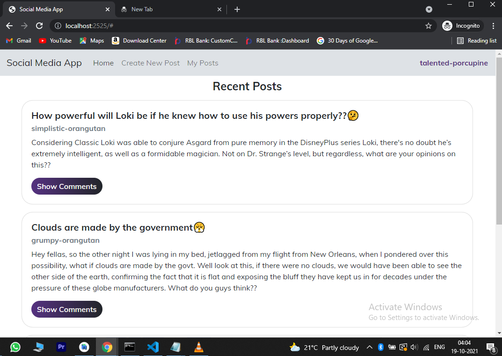
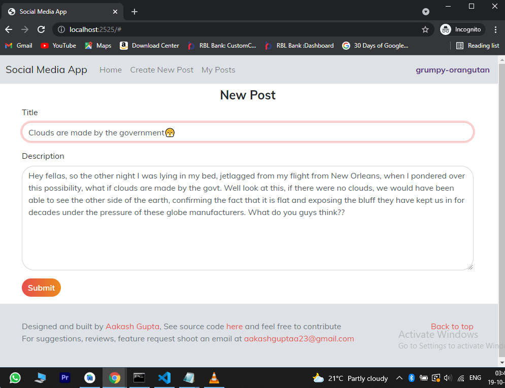
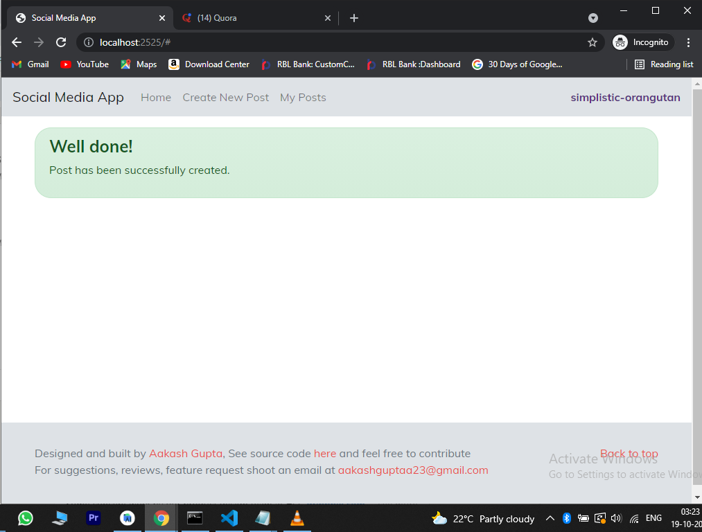
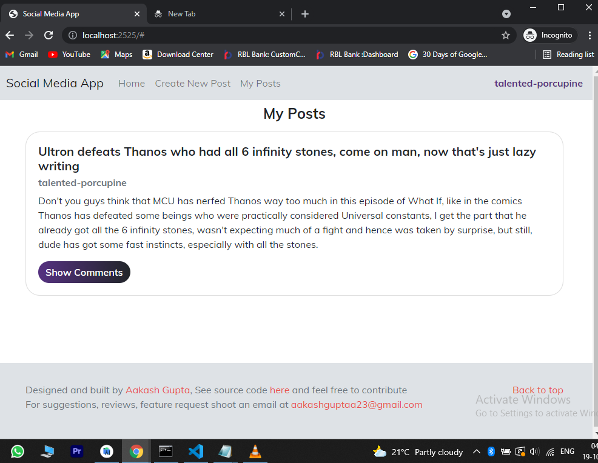
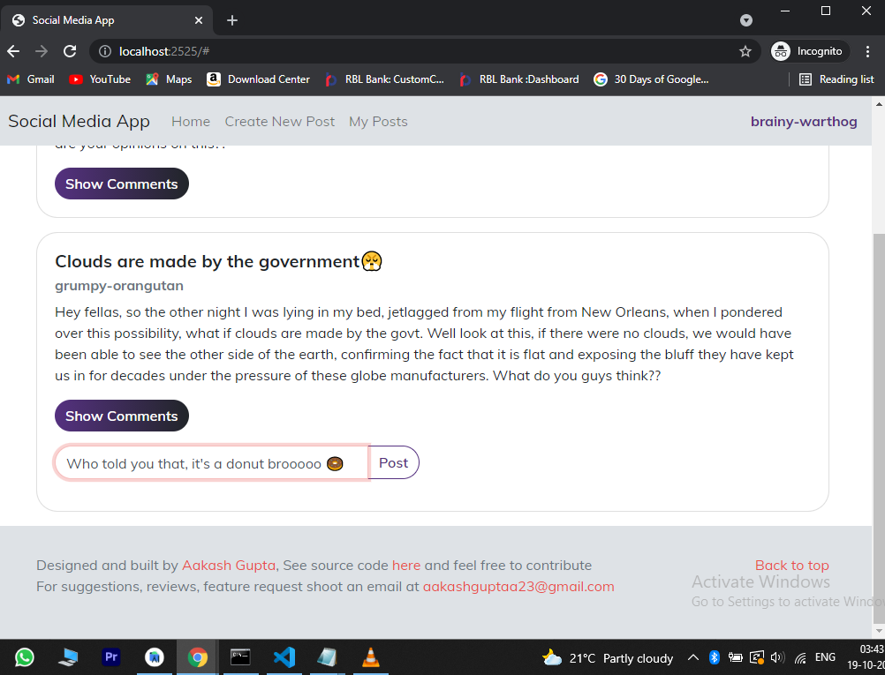
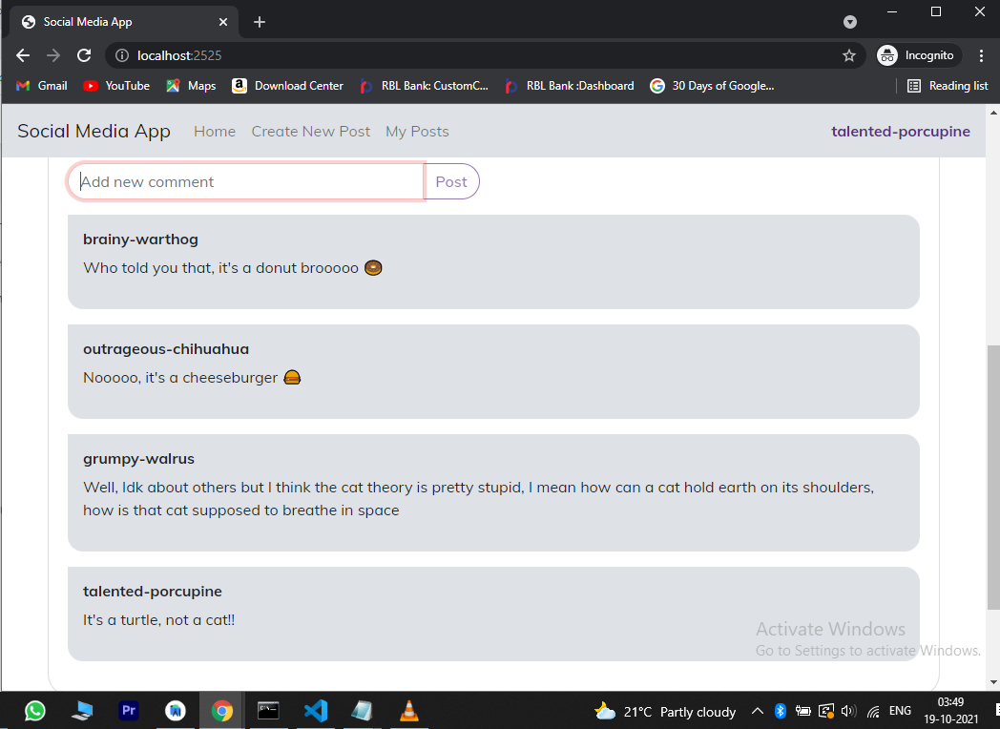
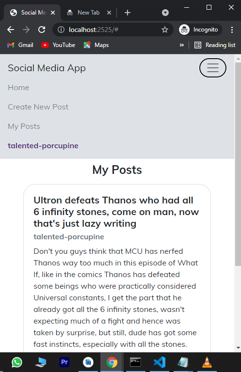

## Technologies used

### Backend
- Node.js
- Express.js
- MySQL Server 8.0
- Sequelize

### Frontend
- HTML, CSS, JS
- Bootstrap
- JQuery

## Project Setup
`Before proceeding make sure you have MySQL, NodeJS and npm installed on your system.` 

Then To run the project on your local machine follow these steps :  

### _Database Setup_
- In powershell/cmd write the following commands:    

```
mysql.exe -u root -p
```      

- You will be prompted to enter the password for root user (setup during installation of MySQL) post which you will be able to write SQL commands in your cmd as follows : 

```
create database social_media_db;

create user sample_user identified with mysql_native_password by 'samplepass';

grant all privileges on social_media_db.* to sample_user;

flush privileges;
```
- Yay! your database setup is complete

### _Starting server_
- Open the project in any IDE like VSCode, and in the terminal write the following command to install necessary dependencies like express, mysql2 and sequelize :    
    
```
npm install
```    

- Then run the following command to start the server    

```
node src/server.js
```

- This will start the server at  http://localhost:2525   
Open this link in any browser to use the app :)
      
## Project Structure
```
├───controllers        //functions to connect routes with db operations    
├───db                 //db connection and model definitions
├───public             //frontend code
│   ├───app            //our own css and frontend js files
│   ├───components     //our own html snippets
│   ├───css            //3rd party css files
│   ├───fonts          //3rd party fonts
│   └───js             //3rd party js files
├───routes             //Express middlewares
│   ├───posts          
│   └───users  
└───utils              //Utility functions
```

_See API documentation [here](API-Documentation.md)_

## Screenshots  








